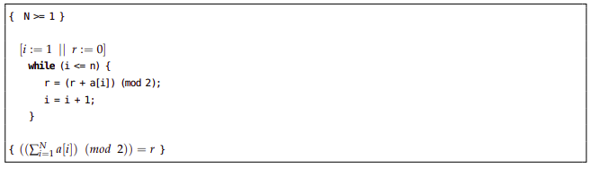

# Verification-of-Programs-with-Hoare-Logic-and-Symbolic-Execution

_Goal_

You have to perform the verification of the partial or total correctness of the next two algorithms. You have
to present in a document a detailed proof of their correctness, following a similar style to the one you have
in the documents of the course with solved verification problems. Explain clearly the meaning of all the
branches that appear in the proof tree, and the final first-order (FO) logical formulas that have to be proven
at each branch after the total execution of the corresponding program of the branch (when you reach the
final state and apply the exit rule). You can use the tool Key-Hoare to help you in the verification process of
the first problem (but it is not possible for the second one).

_First problem (5 points):_

Consider the following breathtaking algoritm for the multiplication of two integer numbers.

You must:

1. Obtain an appropriate invariant for the loop of your the algorithm, and explain it (2 points).

2. Perform the verification of the partial correctness of the algorithm (3 points).

_Second problem (5 points):_

Verify the following algorithm for computing the parity of the sum of the elements of an array a[N] with N ≥ 0 and storing it in the result variable r:

You must:
1. Obtain an appropriate invariant for the loop of your the algorithm, and explain it (1.5 points).

2. Perform the verification of the partial correctness of the algorithm (3.5 points).

Link to the LaTex document: https://www.overleaf.com/read/fcsbwfwnmqfk
